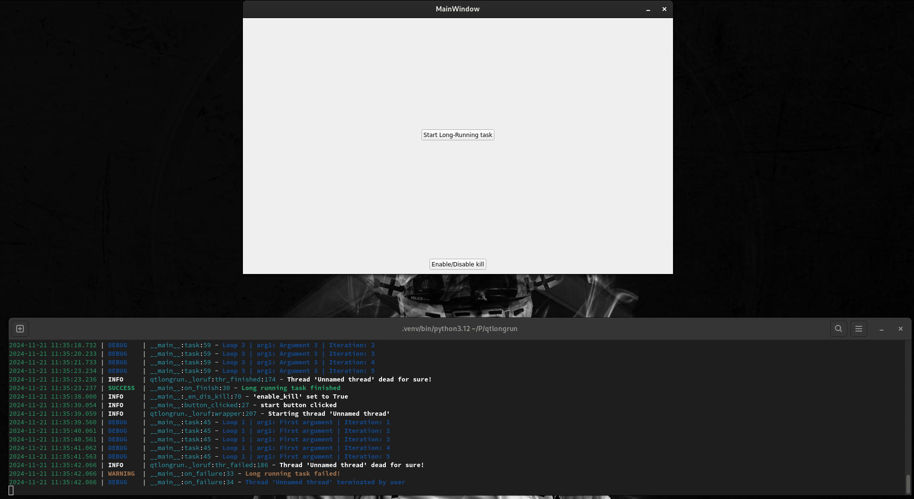

# qtlongrun


Functions for easier use of PyQt threads using decorators.

For example usage see `main.py` file

## Usage

```python
# Add decorator on function you want to run in thread
from qtlongrun import loruf

from PyQt5.QtCore import pyqtSignal

def on_finish():
    ...  # TODO: any code you want to be executed after the thread finishes


def on_failure(ex: Exception):
    ...  # TODO: any code you want to be executed after the thread fails


# on_finish - reference to a function to be executed after the thread finishes
# on_fail - reference to a function to be executed if the thread fails
# window - whether to show loading window
# parent - PyQt parent object for the loading window
# window_title - title to be used for the loading window
# enable_kill - whether to let user kill the thread while it is running by clicking on a kill button
# window_description - initial description showed in the loading window
# window_flags - PyQt flags to be set for loading window
# window_sheet - style sheet to be used for loading window
# spinner_style - Graphic style to be used for LoadingSpinner (instance of SpinnerStyle class)
# thrname - thread name to be used for logs
@loruf(on_finish=on_finish, on_fail=on_failure, window=True, parent=None, window_title='Loading Window', 
       enable_kill=True, window_description='Performing crucial operations')
def task(arg1, arg2, arg3, prog_sig: pyqtSignal, change_desc: pyqtSignal):
    # function can accept any number of arguments, but must also accept prog_sig and change_desc
    # prog_sig is a pyqtSignal which allows you to change value displayed in progressBar
    #    progressBar is hidden at the start and is displayed after the first int value (0-100) is emitted
    # change_desc is also a pyqtSignal which allows you to change the description showed in the loading window
    
    ...  # TODO: add any code you want to execute in the thread

# do not provide prog_sig and change_desc arguments, they are created automatically
task('value 1', arg3='value 3', arg2='value 2')
```

loruf expects that you have already created a QApplication instance

## Example

### Install python

Download Python (version 3.11+) from [official website](https://www.python.org/downloads/).

### Install requirements

Install requirements specified in `requirements.txt` using **pip**.

```bash
pip install -r requirements.txt
```

### Run example

To run example application, run `main.py` script.

```bash
python3 main.py
```


